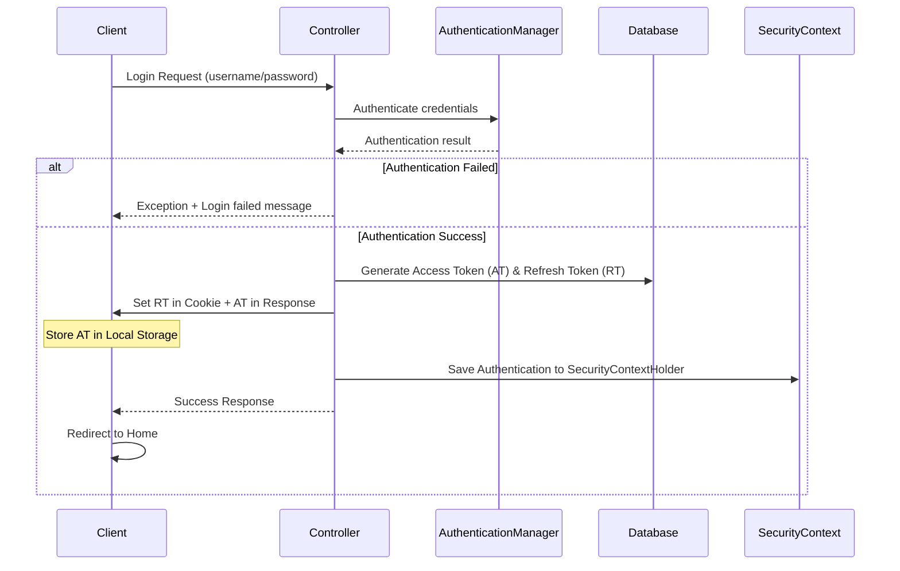
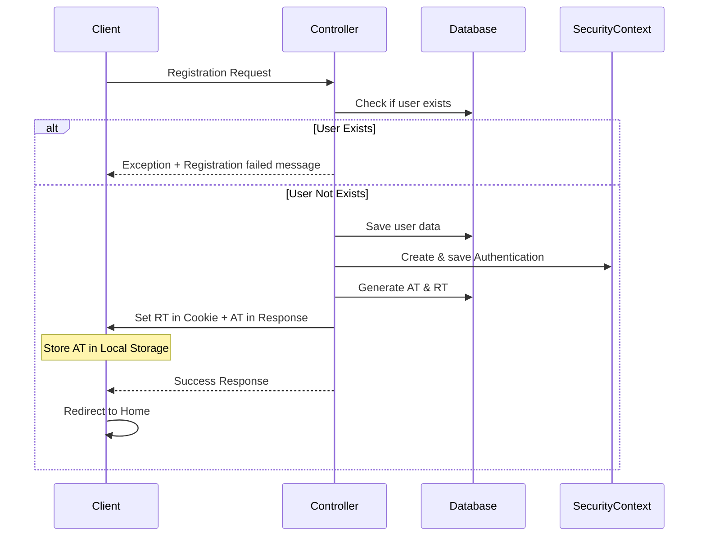
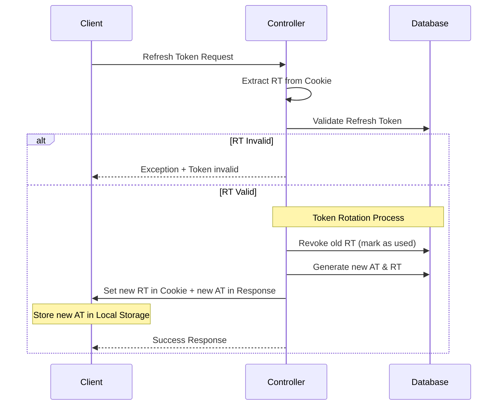
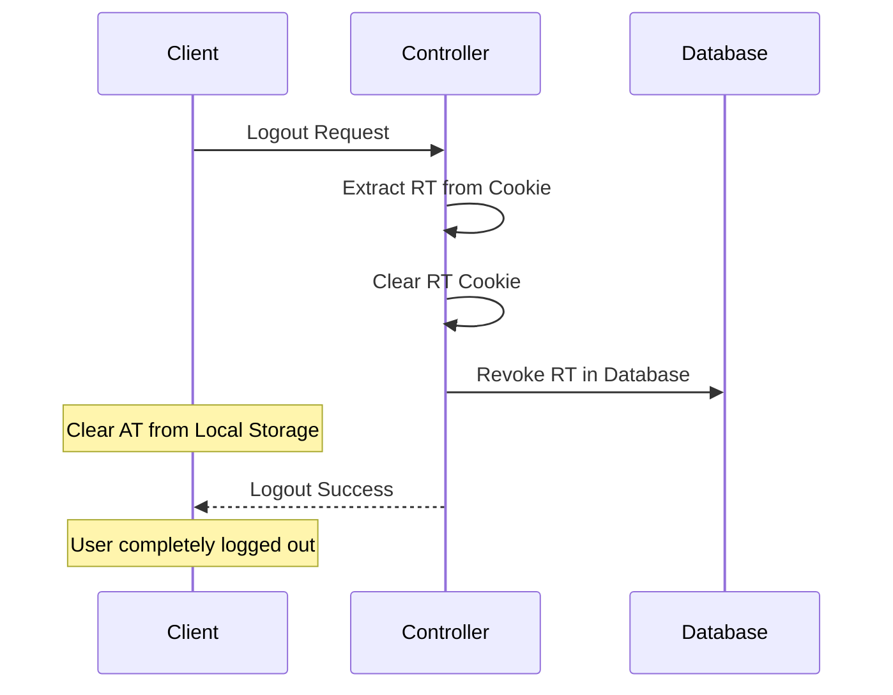
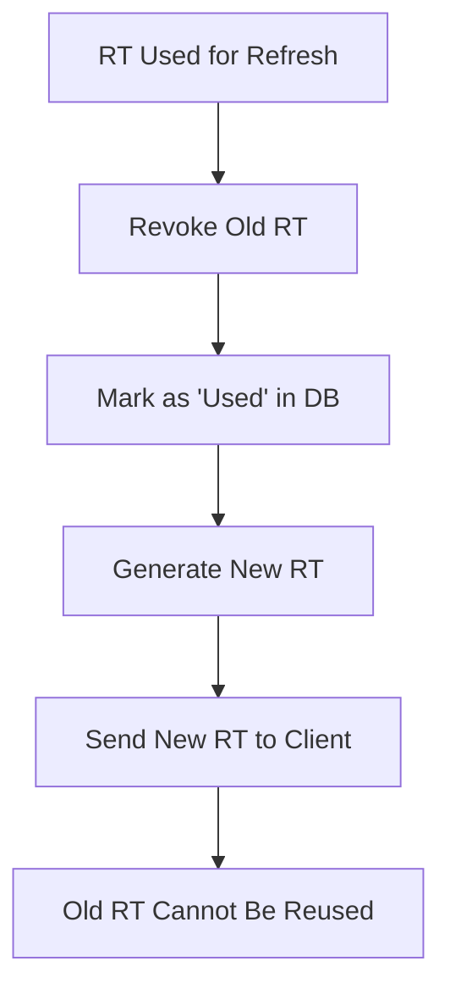

# 🔐 Authentication Flow Documentation

## Overview
This document describes the complete authentication flow implementation including login, registration, token refresh, logout, and security mechanisms.

## 📋 Table of Contents
- [Login Flow](#-login-flow)
- [Registration Flow](#-registration-flow)
- [Token Refresh Flow](#-token-refresh-flow)
- [Logout Flow](#-logout-flow)
- [Token Rotation Security](#-token-rotation-security)

---

## 🔑 Login Flow

### Implementation Steps:
1. **Client** sends login request with username/password to **Controller**
2. **Controller** calls **AuthenticationManager** to validate credentials
3. **Process Result**:
   - ❌ **Invalid**: Throw exception → Login failed notification
   - ✅ **Valid**: 
     - Generate Access Token (AT) and Refresh Token (RT)
     - Store RT in HTTP-only cookie
     - Return AT to client (stored in local storage)
     - Save Authentication in SecurityContextHolder
     - Redirect client to Home page

---

## 📝 Registration Flow

### Implementation Steps:
1. **Client** sends registration request to **Controller**
2. **Controller** checks if user already exists:
   - ❌ **Exists**: Throw exception → Registration failed notification
   - ✅ **Valid**:
     - Save user data to database
     - Create and save Authentication in SecurityContextHolder
     - Generate Access Token and Refresh Token
     - Store tokens (RT in cookie, AT in local storage)
     - Redirect client to Home page

---

## 🔄 Token Refresh Flow

### Implementation Steps:
1. **Client** sends refresh token request
2. **Server** extracts RT from HTTP-only cookie
3. **Validate RT**:
   - ❌ **Invalid**: Throw exception
   - ✅ **Valid**: Execute rotation process:
     - Revoke old RT and mark as used (prevents replay attacks)
     - Generate new Access Token and Refresh Token
     - Store new tokens (RT in cookie, AT in local storage)
     - Return success response → Client continues with new AT

---

## 🚪 Logout Flow

### Implementation Steps:
1. **Client** initiates logout request
2. **Server** processes logout:
   - Extract RT from cookie
   - Clear RT from HTTP-only cookie
   - Revoke RT in database (invalidate token)
3. **Client** clears Access Token from local storage
4. **Result**: User is completely logged out, all tokens are invalidated

---

## 🔒 Token Rotation Security

### Why Token Rotation?
Token rotation is a critical security mechanism that ensures each Refresh Token can only be used once.

### How It Works:

### Security Benefits:
- **🛡️ Replay Attack Prevention**: Each RT is single-use only
- **🔍 Breach Detection**: Reuse of revoked tokens indicates compromise
- **⏰ Limited Exposure Window**: Stolen tokens have minimal lifetime
- **🔄 Automatic Invalidation**: Regular token renewal reduces risk

### Implementation Details:
1. **Before Rotation**: Validate current RT
2. **During Rotation**: 
   - Revoke old RT (set status to 'used')
   - Generate new RT with fresh expiration
3. **After Rotation**: Old RT becomes permanently invalid

---

## 🏗️ Architecture Components

| Component | Responsibility |
|-----------|---------------|
| **Controller** | Handle HTTP requests/responses |
| **AuthenticationManager** | Validate user credentials |
| **SecurityContextHolder** | Manage authentication state |
| **Token Service** | Generate/validate/revoke tokens |
| **Database** | Store user data and token metadata |

---
